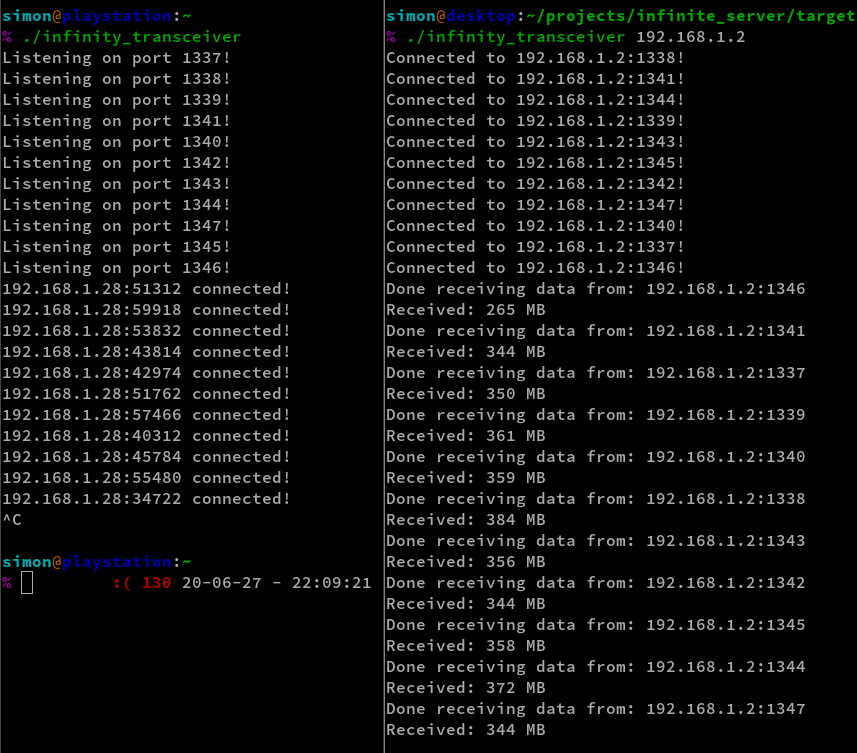

# Infinity Transceiver

## Point

Have a simple Rust program that opens 10 tcp sockets.

When another instance of the program connects,
it aims to saturate the link in one direction.

## Usage

Invoking `./infinity_transceiver` will start listening on the tcp ports 1337 - 1347.

Invoking `./infinity_transceiver [IP of peer]` will connect to ports 1337 - 1347 of the target IPv4 address.

After a connection has been made, the server will send 0 bytes on all ports to the client, until one of the peers is closed.
The other will show the data sent in MegaBytes.

## Example

